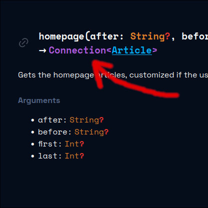
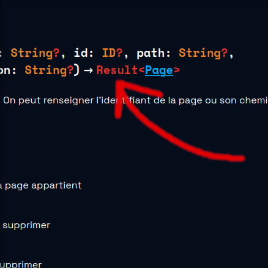
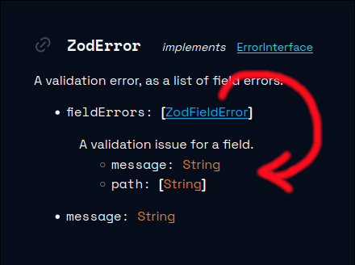
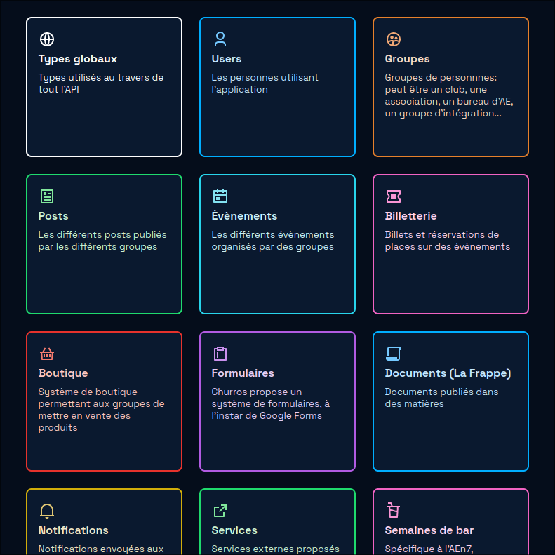
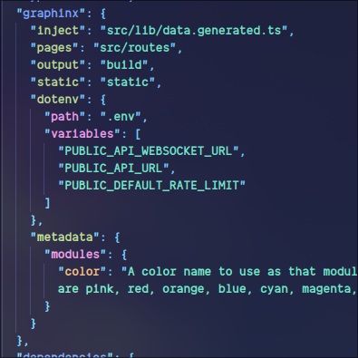

<p align="center">
<br>
<i>Beautiful, auto-generated API documentation for your GraphQL APIs.</i>
<br>
<br>
<br>
</p>

## Production example

- [Churros](https://github.com/inp-net/churros)' API: [api-docs.churros.inpt.fr](https://api-docs.churros.inpt.fr)

## Features

### Less noise

|                              |                                                                                                                                                                                                            |
| ---------------------------- | ---------------------------------------------------------------------------------------------------------------------------------------------------------------------------------------------------------- |
|         | <h4>Relay integration</h4><br> Don't pollute your documentation with hundreds of `ThingEdge` and `ThingConnection` types. Graphinx will automatically detect them and display them as `Connection<Thing>`. |
|  | <h4>Result types</h4><br> Similarly, Graphinx will detect return types that are unions of a Success type and error types.                                                                                  |

### Less indirection

|                                                                                                                                                                                                                                                                                                         |                               |
| ------------------------------------------------------------------------------------------------------------------------------------------------------------------------------------------------------------------------------------------------------------------------------------------------------- | ----------------------------- |
| Some types are only used in one place. Documenting them somewhere else is unecessary, and makes answering the important question complex: _what data can I get on this object?_ <br><br> Graphinx gives template the opportunity to _embed types when they are only referenced by a single other type_. |  |

### Ready for scale

|                         |                                                                                                                                                                                                                                                                                                                                                                                                                                          |
| ----------------------- | ---------------------------------------------------------------------------------------------------------------------------------------------------------------------------------------------------------------------------------------------------------------------------------------------------------------------------------------------------------------------------------------------------------------------------------------- |
|  | Big GraphQL APIs have _a lot_ of types, queries and mutations. Don't let your users read a 10,000-pages-long dump of unrelated, alphabetically-sorted types. <br><br> With Graphinx, you organize your schema items (types, queries, mutations and subscriptions) into _modules_. <br><br> You can define modules manually, or [define patterns to auto-categorize your items based on your source code](#reference-filesystem_modules). |

### Extensible

|                                                                                                                                                                                                                                                                                                                                                                                                                                                                                                                                                                                                                                    |                                                                        |
| ---------------------------------------------------------------------------------------------------------------------------------------------------------------------------------------------------------------------------------------------------------------------------------------------------------------------------------------------------------------------------------------------------------------------------------------------------------------------------------------------------------------------------------------------------------------------------------------------------------------------------------- | ---------------------------------------------------------------------- |
| As with the Sphinx documentation tool, Graphinx is template-based: if you want your documentation site to have a unique look, [it's really easy to do so](https://github.com/graphinx/templates/blob/main/CONTRIBUTING.md).<br><br> Graphinx essentially processes your schema into data that's ready to use for documentation site generation. [Here's an example](./example/generated.data.ts) of what the generated data made available to templates looks like <br><bR> Right now, Graphinx offers a gorgeous default template, and a _markdown_ template, that exports an index markdown file as well as one file per module. |  <br> _A template's `package.json`_ |

## Getting Started

1. Add Graphinx to your dev dependencies:

   ```bash
   yarn add --dev graphinx
   ```

2. Initialize a config file

   ```bash
   yarn graphinx --init
   ```

## Configuration

Configuration is done through a `.graphinx.yaml` config file. The path to the config file can be changed with `--config`.

A JSON schema is available at <https://raw.githubusercontent.com/graphinx/graphinx/main/config.schema.json>.

<!-- Include docs/config.md -->
### Objects
* [`Graphinx`](#reference-graphinx) (root object)
* [`Modules configuration`](#reference-modules)
    * [`Index module configuration`](#reference-index_module)
    * [`Match modules with source code`](#reference-filesystem_modules)
        * [`Module names`](#reference-filesystem_module_names)
        * [`Source code module matcher`](#reference-filesystem_matcher)
    * [`Static module configuration`](#reference-static_module)
* [`Relay`](#reference-relay)
* [`Result types`](#reference-result-types)
* [`Schema`](#reference-schema)
    * [`introspection`](#reference-schema_introspection)
* [`Site branding`](#reference-sitebranding)
    * [`logo`](#reference-sitebrandinglogo)


---------------------------------------
<a name="reference-graphinx"></a>
#### Graphinx

Configuration file for Graphinx, a tool to generate a documentation website for a GraphQL API

**`Graphinx` Properties**

|   |Type|Description|Required|
|---|---|---|---|
|**template**|`string`|Degit repository specifier to use as the website template. Defaults to Graphinx's default template.  See [degit's documentation](https://www.npmjs.com/package/degit#basics) for more information.  Basic syntax is `owner/repo/path#branch` for github repositories, or `https://example.com/...` for any git repository.  The only difference is that the default branch name is "main" instead of master (i.e. use  `...#master` to clone the master branch, and `...#main` is not needed)|No|
|**branding**|`SiteBranding`|Branding information for the API| &#10003; Yes|
|**description**|`string`|Markdown-formatted text to display on the homepage. Use this to mention the purpose of the API, how to authenticate, and anything you want. Depending on the template you use, a search bar, as well as the list of all the modules will be displayed below, as well as other information such as the endpoint URL. Check with your template's documentation.| &#10003; Yes|
|**footer**|`string`|HTML to insert at the bottom of every page|No|
|**static**|`string`|Directory to look for additional static files that will be copied to the template's `static` directory, to be served at the root of the website| &#10003; Yes|
|**pages**|`string`|Directory to look for additional documentation pages, as markdown or [MDSveX (.svx)](https://mdsvex.pngwn.io/) files. The final URL will be the path to the markdown file relative to the value of `pages`, without the `.md` extension. For example, with `pages: ./docs`, a page defined in `./docs/foo/bar.md` will be available at `/foo/bar`. Files are copied at build time into the template code at `src/routes/(path to file without extension)/+page.svx`. If the filename is prefix with a `+`, it'll be copied in src/routes directly (not in a subdirectory)| &#10003; Yes|
|**environment**|`object`|Define environment variables that will be made available to the template.|No|
|**relay**|`relay`|Configure handling for GraphQL Relay connection types. Queries that have a return type that match the `connection` property will be considered as connection types, and will display `Connection<T>` in the documentation, where `T` is the type of the `node` field.|No|
|**errors**|`result-types`|Configure error-related types. Queries that have a return type that match  `result` will be considered as error types, and will display `Result<T>` in the documentation, where `T` is the type of `success`'s field `data`.|No|
|**modules**|`modules`|Categorize your schema's items. If not specified, all items will be displayed in a single module|No|
|**schema**|`schema`|A path or URL to a graphl schema file, or configuration for introspection| &#10003; Yes|

Additional properties are not allowed.

##### Graphinx.template

Degit repository specifier to use as the website template. Defaults to Graphinx's default template.  See [degit's documentation](https://www.npmjs.com/package/degit#basics) for more information.  Basic syntax is `owner/repo/path#branch` for github repositories, or `https://example.com/...` for any git repository.  The only difference is that the default branch name is "main" instead of master (i.e. use  `...#master` to clone the master branch, and `...#main` is not needed)

* **Type**: `string`
* **Required**: No
* **Examples**:
    * `"graphinx/graphinx/packages/template#main"`

##### Graphinx.branding

Branding information for the API

* **Type**: `SiteBranding`
* **Required**:  &#10003; Yes

##### Graphinx.description

Markdown-formatted text to display on the homepage. Use this to mention the purpose of the API, how to authenticate, and anything you want. Depending on the template you use, a search bar, as well as the list of all the modules will be displayed below, as well as other information such as the endpoint URL. Check with your template's documentation.

* **Type**: `string`
* **Required**:  &#10003; Yes

##### Graphinx.footer

HTML to insert at the bottom of every page

* **Type**: `string`
* **Required**: No

##### Graphinx.static

Directory to look for additional static files that will be copied to the template's `static` directory, to be served at the root of the website

* **Type**: `string`
* **Required**:  &#10003; Yes
* **Examples**:
    * `"./static"`

##### Graphinx.pages

Directory to look for additional documentation pages, as markdown or [MDSveX (.svx)](https://mdsvex.pngwn.io/) files. The final URL will be the path to the markdown file relative to the value of `pages`, without the `.md` extension. For example, with `pages: ./docs`, a page defined in `./docs/foo/bar.md` will be available at `/foo/bar`. Files are copied at build time into the template code at `src/routes/(path to file without extension)/+page.svx`. If the filename is prefix with a `+`, it'll be copied in src/routes directly (not in a subdirectory)

* **Type**: `string`
* **Required**:  &#10003; Yes

##### Graphinx.environment

Define environment variables that will be made available to the template.

* **Type**: `object`
* **Required**: No
* **Type of each property**: `string`

##### Graphinx.relay

Configure handling for GraphQL Relay connection types. Queries that have a return type that match the `connection` property will be considered as connection types, and will display `Connection<T>` in the documentation, where `T` is the type of the `node` field.

* **Type**: `relay`
* **Required**: No

##### Graphinx.errors

Configure error-related types. Queries that have a return type that match  `result` will be considered as error types, and will display `Result<T>` in the documentation, where `T` is the type of `success`'s field `data`.

* **Type**: `result-types`
* **Required**: No

##### Graphinx.modules

Categorize your schema's items. If not specified, all items will be displayed in a single module

* **Type**: `modules`
* **Required**: No

##### Graphinx.schema

A path or URL to a graphl schema file, or configuration for introspection

* **Type**: `schema`
* **Required**:  &#10003; Yes


---------------------------------------
<a name="reference-index_module"></a>
#### Index module configuration

Configure the "index" module, that contains every schema item. Set this to false, or remove it, to disable the index module. Set to true to enable it, with default values

**`Index module configuration` Properties**

|   |Type|Description|Required|
|---|---|---|---|
|**title**|`string`|Display name of the index module|No|
|**description**|`string`|A Markdown-formatted text describing the index module|No|

Additional properties are not allowed.

##### index_module.title

Display name of the index module

* **Type**: `string`
* **Required**: No
* **Examples**:
    * `"Index"`

##### index_module.description

A Markdown-formatted text describing the index module

* **Type**: `string`
* **Required**: No
* **Examples**:
    * `"The entire GraphQL schema"`


---------------------------------------
<a name="reference-filesystem_modules"></a>
#### Match modules with source code

Auto-categorize using your API's source code tree. Every value in here can use %module%, which will be replaced by the module we are currently checking.

**`Match modules with source code` Properties**

|   |Type|Description|Required|
|---|---|---|---|
|**names**|`filesystem_module_names`||No|
|**order**|`string` `[]`|Order in which to display the modules. If a module is not listed here, it will be displayed at the end. If not specified, the order is alphabetical|No|
|**intro**|`string`|Path to a markdown file describing the module. The first paragraph will serve as the short description, while the `<h1>`'s content will serve as the module's display name. Additional metadata can be used by templates when put in the file's YAML frontmatter (put three dashes, YAML content, and three dashes at the begnning of the file)| &#10003; Yes|
|**icon**|`string`|Path or URL to an icon for the module|No|
|**contribution**|`string`|URL to contribute to the documentation for this module. If omitted, the "contribute" button will not be displayed|No|
|**source**|`string`|URL to view the source code for this module. If omitted, the "source" button will not be displayed|No|
|**items**|`filesystem_matcher` `[]`|How to know that a given schema item (a type, a query, a mutation, etc.) should belong to that module?| &#10003; Yes|

Additional properties are not allowed.

##### filesystem_modules.names

* **Type**: `filesystem_module_names`
* **Required**: No

##### filesystem_modules.order

Order in which to display the modules. If a module is not listed here, it will be displayed at the end. If not specified, the order is alphabetical

* **Type**: `string` `[]`
* **Required**: No

##### filesystem_modules.intro

Path to a markdown file describing the module. The first paragraph will serve as the short description, while the `<h1>`'s content will serve as the module's display name. Additional metadata can be used by templates when put in the file's YAML frontmatter (put three dashes, YAML content, and three dashes at the begnning of the file)

* **Type**: `string`
* **Required**:  &#10003; Yes

##### filesystem_modules.icon

Path or URL to an icon for the module

* **Type**: `string`
* **Required**: No
* **Format**: uri

##### filesystem_modules.contribution

URL to contribute to the documentation for this module. If omitted, the "contribute" button will not be displayed

* **Type**: `string`
* **Required**: No
* **Format**: uri

##### filesystem_modules.source

URL to view the source code for this module. If omitted, the "source" button will not be displayed

* **Type**: `string`
* **Required**: No
* **Format**: uri

##### filesystem_modules.items

How to know that a given schema item (a type, a query, a mutation, etc.) should belong to that module?

* **Type**: `filesystem_matcher` `[]`
* **Required**:  &#10003; Yes


---------------------------------------
<a name="reference-filesystem_module_names"></a>
#### Module names


---------------------------------------
<a name="reference-modules"></a>
#### Modules configuration

Categorize your schema's items. If not specified, all items will be displayed in a single module

**`Modules configuration` Properties**

|   |Type|Description|Required|
|---|---|---|---|
|**index**|`index_module`|Configure the "index" module, that contains every schema item. Set this to false, or remove it, to disable the index module. Set to true to enable it, with default values|No|
|**filesystem**|`filesystem_modules`|Auto-categorize using your API's source code tree. Every value in here can use %module%, which will be replaced by the module we are currently checking.|No|
|**static**|`static_module` `[]`|Manually declare modules.|No|

Additional properties are not allowed.

##### modules.index

Configure the "index" module, that contains every schema item. Set this to false, or remove it, to disable the index module. Set to true to enable it, with default values

* **Type**: `index_module`
* **Required**: No

##### modules.filesystem

Auto-categorize using your API's source code tree. Every value in here can use %module%, which will be replaced by the module we are currently checking.

* **Type**: `filesystem_modules`
* **Required**: No

##### modules.static

Manually declare modules.

* **Type**: `static_module` `[]`
* **Required**: No


---------------------------------------
<a name="reference-relay"></a>
#### Relay

Configure handling for GraphQL Relay connection types. Queries that have a return type that match the `connection` property will be considered as connection types, and will display `Connection<T>` in the documentation, where `T` is the type of the `node` field.

**`Relay` Properties**

|   |Type|Description|Required|
|---|---|---|---|
|**connection**|`string`|How are Connection types named?| &#10003; Yes|
|**edge**|`string`|A dotted path to the edge field in the connection type (default is `edges`)|No|
|**node**|`string`|A dotted path to the node field in the connection type (default is `edges.node`)|No|

Additional properties are not allowed.

##### relay.connection

How are Connection types named?

* **Type**: `string`
* **Required**:  &#10003; Yes
* **Examples**:
    * `"(Query|Mutation)\w+Connection"`

##### relay.edge

A dotted path to the edge field in the connection type (default is `edges`)

* **Type**: `string`
* **Required**: No
* **Examples**:
    * `"edges"`

##### relay.node

A dotted path to the node field in the connection type (default is `edges.node`)

* **Type**: `string`
* **Required**: No
* **Examples**:
    * `"edges.node"`
    * `"nodes"`


---------------------------------------
<a name="reference-result-types"></a>
#### Result types

Configure error-related types. Queries that have a return type that match  `result` will be considered as error types, and will display `Result<T>` in the documentation, where `T` is the type of `success`'s field `data`.

**`Result types` Properties**

|   |Type|Description|Required|
|---|---|---|---|
|**result**|`string`|How are your result types named?|No|
|**success**|`string`|How are your success types named?|No|
|**data**|`string`|A dotted path that describes how get to the data field in the success type (default is `data`)|No|

Additional properties are not allowed.

##### result-types.result

How are your result types named?

* **Type**: `string`
* **Required**: No
* **Examples**:
    * `"(Query|Mutation)\w+Result"`

##### result-types.success

How are your success types named?

* **Type**: `string`
* **Required**: No
* **Examples**:
    * `"(Query|Mutation)\w+Success"`

##### result-types.data

A dotted path that describes how get to the data field in the success type (default is `data`)

* **Type**: `string`
* **Required**: No
* **Examples**:
    * `"data"`


---------------------------------------
<a name="reference-schema"></a>
#### Schema

A path or URL to a graphl schema file, or configuration for introspection

**`Schema` Properties**

|   |Type|Description|Required|
|---|---|---|---|
|**introspection**|`schema_introspection`|Introspect a GraphQL schema of a given running GraphQL API server|No|
|**static**|`string`|Path or URL to a GraphQL schema file|No|

Additional properties are not allowed.

##### schema.introspection

Introspect a GraphQL schema of a given running GraphQL API server

* **Type**: `schema_introspection`
* **Required**: No

##### schema.static

Path or URL to a GraphQL schema file

* **Type**: `string`
* **Required**: No
* **Examples**:
    * `"./schema.graphql"`


---------------------------------------
<a name="reference-schema_introspection"></a>
#### Schema introspection

Introspect a GraphQL schema of a given running GraphQL API server

**`Schema introspection` Properties**

|   |Type|Description|Required|
|---|---|---|---|
|**url**|`string`|URL where to query the API to generate a schema via introspection| &#10003; Yes|
|**headers**|`object`|Define headers to use when doing the POST request. For example, an authorization header|No|

Additional properties are not allowed.

##### schema_introspection.url

URL where to query the API to generate a schema via introspection

* **Type**: `string`
* **Required**:  &#10003; Yes
* **Format**: uri

##### schema_introspection.headers

Define headers to use when doing the POST request. For example, an authorization header

* **Type**: `object`
* **Required**: No
* **Type of each property**: `string`


---------------------------------------
<a name="reference-sitebranding"></a>
#### Site branding

Branding information for the API

**`Site branding` Properties**

|   |Type|Description|Required|
|---|---|---|---|
|**logo**|`SiteBrandingLogo`|Logo for the API| &#10003; Yes|
|**name**|`string`|Name of the API| &#10003; Yes|

Additional properties are not allowed.

##### SiteBranding.logo

Logo for the API

* **Type**: `SiteBrandingLogo`
* **Required**:  &#10003; Yes

##### SiteBranding.name

Name of the API

* **Type**: `string`
* **Required**:  &#10003; Yes


---------------------------------------
<a name="reference-sitebrandinglogo"></a>
#### Site branding logo

Logo for the API

**`Site branding logo` Properties**

|   |Type|Description|Required|
|---|---|---|---|
|**light**|`string`|Path or URL to the API's logo which will be used on a light background|No|
|**dark**|`string`|Path or URL to the API's logo which will be used on a dark background|No|

Additional properties are not allowed.

##### SiteBrandingLogo.light

Path or URL to the API's logo which will be used on a light background

* **Type**: `string`
* **Required**: No
* **Format**: uri

##### SiteBrandingLogo.dark

Path or URL to the API's logo which will be used on a dark background

* **Type**: `string`
* **Required**: No
* **Format**: uri


---------------------------------------
<a name="reference-filesystem_matcher"></a>
#### Source code module matcher

**`Source code module matcher` Properties**

|   |Type|Description|Required|
|---|---|---|---|
|**files**|`string`|Glob pattern of file paths to search in| &#10003; Yes|
|**debug**|`string` `[]`|Display debug information when this matcher found a match or did not found a match for a given list of item names|No|
|**match**|`string`|Regular expressions that will be tried for every file found in `files`. The regexp must define a named capture group named `name`. A given GraphQL Schema item will be considered as part of that module if a line of any file as specified by `files` matches this regular expression, with the capture group named `name` having as value the GraphQL schema type's name.| &#10003; Yes|
|**contribution**|`string`|URL to use for the "contribute" button for that item. Available placeholders are:

- %module%, 
- %name%, the item's name
- %path%, the path to the file that matched

If the value is not specified, the "contribute" button will not be displayed
|No|
|**source**|`string`|URL to view the source code for this item. Available placeholders are the same as for `contribution`|No|

Additional properties are not allowed.

##### filesystem_matcher.files

Glob pattern of file paths to search in

* **Type**: `string`
* **Required**:  &#10003; Yes

##### filesystem_matcher.debug

Display debug information when this matcher found a match or did not found a match for a given list of item names

* **Type**: `string` `[]`
* **Required**: No

##### filesystem_matcher.match

Regular expressions that will be tried for every file found in `files`. The regexp must define a named capture group named `name`. A given GraphQL Schema item will be considered as part of that module if a line of any file as specified by `files` matches this regular expression, with the capture group named `name` having as value the GraphQL schema type's name.

* **Type**: `string`
* **Required**:  &#10003; Yes

##### filesystem_matcher.contribution

URL to use for the "contribute" button for that item. Available placeholders are:

- %module%, 
- %name%, the item's name
- %path%, the path to the file that matched

If the value is not specified, the "contribute" button will not be displayed


* **Type**: `string`
* **Required**: No

##### filesystem_matcher.source

URL to view the source code for this item. Available placeholders are the same as for `contribution`

* **Type**: `string`
* **Required**: No


---------------------------------------
<a name="reference-static_module"></a>
#### Static module configuration

**`Static module configuration` Properties**

|   |Type|Description|Required|
|---|---|---|---|
|**title**|`string`|Display name of the module| &#10003; Yes|
|**name**|`string`|URL-friendly name of the module. Cannot be "index" (reserved for the index module)| &#10003; Yes|
|**intro**|`string`|A Markdown-formatted text describing the module| &#10003; Yes|
|**icon**|`string`|Path or URL to an icon for the module|No|
|**contribution**|`string`|URL to contribute to the documentation of an item. Available placeholders are %module% and %name%, the name of the item. If omitted, the "contribute" button will not be displayed|No|
|**source**|`string`|URL to view the source code for item. Available placeholders are %module% and %name%. If omitted, the "source" button will not be displayed|No|
|**items**|`string` `[]`|List of schema item names that belong in that module| &#10003; Yes|

Additional properties are not allowed.

##### static_module.title

Display name of the module

* **Type**: `string`
* **Required**:  &#10003; Yes

##### static_module.name

URL-friendly name of the module. Cannot be "index" (reserved for the index module)

* **Type**: `string`
* **Required**:  &#10003; Yes

##### static_module.intro

A Markdown-formatted text describing the module

* **Type**: `string`
* **Required**:  &#10003; Yes

##### static_module.icon

Path or URL to an icon for the module

* **Type**: `string`
* **Required**: No
* **Format**: uri

##### static_module.contribution

URL to contribute to the documentation of an item. Available placeholders are %module% and %name%, the name of the item. If omitted, the "contribute" button will not be displayed

* **Type**: `string`
* **Required**: No
* **Format**: uri

##### static_module.source

URL to view the source code for item. Available placeholders are %module% and %name%. If omitted, the "source" button will not be displayed

* **Type**: `string`
* **Required**: No
* **Format**: uri

##### static_module.items

List of schema item names that belong in that module

* **Type**: `string` `[]`
* **Required**:  &#10003; Yes


## Available templates

See [graphinx/templates](https://github.com/graphinx/templates?tab=readme-ov-file#list-of-templates)

## Creating a new template

See [graphinx/templates' contribution guide](https://github.com/graphinx/templates/blob/main/CONTRIBUTING.md)
